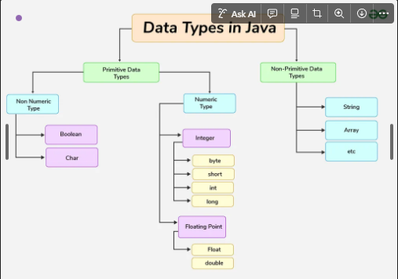
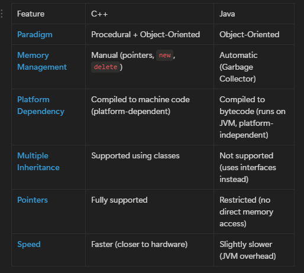
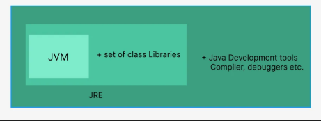
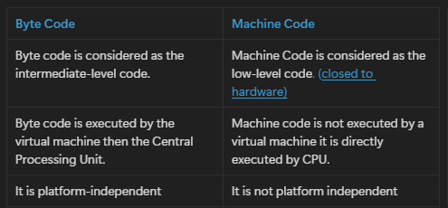

# What is java ?

* Like we as humans, understand the language we speak  like hindi, english, gujarati, kannada so similarly computer understand the language which is a programming language .
* So , Java is one of the programming language(700+ exist in market) to communicate to the computer and performs tasks as per the given instruction.

---

# Features of Java :

Java is a versatile and widely used programming language known for its unique features that contribute to its popularity. These features, often referred to as Java's " **buzzwords** ," are designed to make it portable, simple, secure, and suitable for a variety of applications.

Below is a compilation of the key features that define the Java language.

1. **Simple:**
2. **Object-Oriented:**
3. **Platform Independent /Portable :**

   * Java allows you to write code once and run it anywhere.
   * It works on different platforms like Windows, Linux, and Mac without modification.
4. **Secured:**
5. **Robust:**

   * Java is strong and reliable.
   * It manages memory efficiently, includes automatic garbage collection, and handles exceptions, making programs less prone to errors.

   ---

# How Java Executes code ?

**Bytecode** is the intermediate representation of Java code, generated by the Java compiler. It is platform-independent and can be executed by the JVM.

---

JVM= Java Virtual machine

JRE=Java Runtime environment

 Garbage collector = automatically delete the ununsed memory/variables/functions

## Q - Differenve between bytecode & machine code ?

---

# Data Types

